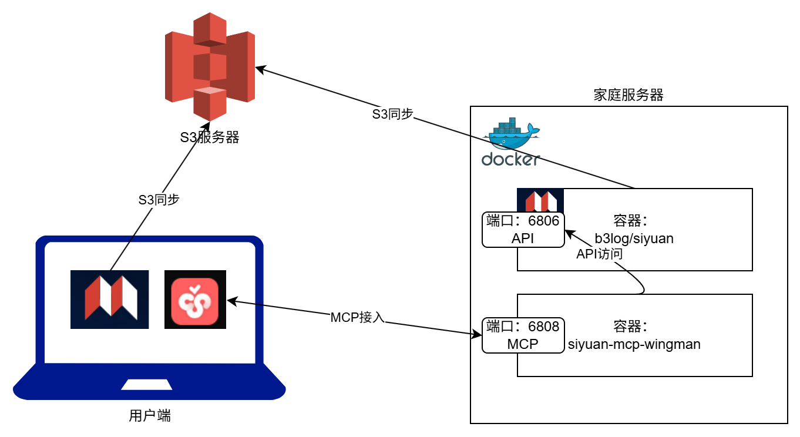

# 思源MCP僚机

思源笔记 MCP (Model Context Protocol) 服务，提供与思源笔记 API 的交互接口。

## 功能特性

- **笔记本管理**：获取笔记本列表、配置、根据名称获取笔记本
- **文档操作**：使用 Markdown 创建文档
- **搜索功能**：全文搜索、块搜索、标签搜索、引用块搜索、模板搜索、嵌入块搜索
- **导出功能**：导出 Markdown、HTML、预览 HTML、思源 Markdown
- **系统管理**：获取版本号、当前时间、工作空间目录、配置、设置外观模式、获取系统字体、工作空间账号、更新日志
- **大纲管理**：获取文档大纲
- **同步管理**：获取同步信息、执行同步、获取云端空间

## 安装方法

### 方法一：直接运行

1. 克隆项目
   ```bash
   git clone https://github.com/your-username/siyuan-mcp-wingman.git
   cd siyuan-mcp-wingman
   ```

2. 安装依赖
   ```bash
   # 使用 uv 包管理器
   pip install uv
   uv pip install -e .
   ```

3. 运行服务
   ```bash
   # 设置环境变量
   export SIYUAN_URL=http://localhost:6806
   export SIYUAN_TOKEN=your-token-here
   
   # 启动服务
   python server.py
   ```

### 方法二：Docker 部署

1. 运行容器(命令)
   ```bash
   docker run -d --name siyuan-mcp -p 8000:8000 \
     -e SIYUAN_URL=http://your-siyuan-server:6806 \
     -e SIYUAN_TOKEN=your-actual-token \
     brantwang/siyuan-mcp-wingman:v0.0.9
   ```
2. 运行容器(DockerCompose)[推荐]

**部署逻辑**


**compose 配置文件**

   ```yaml
   version: "3.9"
    services:
      siyuan:
        image: b3log/siyuan:v3.6.1
        command: ['--workspace=/siyuan/workspace/', '--accessAuthCode=auth-code-here']
        ports:
          - 6806:6806
        volumes:
          - ./siyuan/workspace:/siyuan/workspace
        restart: unless-stopped
        environment:
          - TZ=Asia/Shanghai
          - PUID=1000  # 自定义用户 ID
          - PGID=1000  # 自定义组 ID
      wingman:
        image: brantwang/siyuan-mcp-wingman:v0.0.9
        ports:
          - 6808:8000
        restart: unless-stopped
        environment:
          - SIYUAN_TOKEN=your-token-here
          - SIYUAN_URL=http://siyuan:6806
   ```
Compose启动后使用CherryStudio连接MCP服务端点：`http://your-server:6808/mcp`,类型为`可流式传输的HTTP(streamableHttp)`


## 环境变量配置

| 环境变量 | 描述 | 默认值 |
|---------|------|--------|
| SIYUAN_URL | 思源服务器地址 | http://your-siyuan-server:6806 |
| SIYUAN_TOKEN | 认证令牌 | your-token-here |

## 使用方法

### MCP 服务端点

服务启动后，MCP 端点地址为：`http://your-server:6808/mcp`

### 可用工具

**笔记本管理**
- `list_notebooks()` - 获取笔记本列表
- `get_notebook_conf(notebook_id: str)` - 获取笔记本配置
- `get_notebook_by_name(name: str)` - 根据名称获取笔记本

**文档操作**
- `create_doc_with_md(notebook_id: str, path: str, markdown: str)` - 使用 Markdown 创建文档

**搜索功能**
- `full_text_search_block(query: str, page_size: int = 50, notebook_id: Optional[str] = None, method: int = 0, orderBy: int = 0, types: Optional[dict] = None, path: Optional[str] = None)` - 全文搜索块
- `search_block(query: str, notebook_id: Optional[str] = None)` - 搜索块
- `search_tag(keyword: str = "")` - 搜索标签
- `search_ref_block(id: str, root_id: str, keyword: str, before_len: int, req_id: Optional[str] = None, is_square_brackets: bool = False, is_database: bool = False)` - 搜索引用块
- `search_template(keyword: str = "")` - 搜索模板
- `search_widget(keyword: str = "")` - 搜索小部件
- `search_embed_block(embed_block_id: str, stmt: str, exclude_ids: Optional[List[str]] = None, heading_mode: int = 0, breadcrumb: bool = False)` - 搜索嵌入块
- `get_embed_block(embed_block_id: str, include_ids: List[str], heading_mode: int = 0, breadcrumb: bool = False)` - 获取嵌入块

**导出功能**
- `export_md_content(doc_id: str)` - 导出 Markdown 内容
- `export_preview_html(doc_id: str, keep_lazy_load: bool = False)` - 导出预览 HTML

**系统管理**
- `version()` - 获取思源版本号
- `get_current_time()` - 获取思源服务器当前时间
- `get_workspace_dir()` - 获取工作空间目录
- `get_conf()` - 获取配置

**大纲管理**
- `get_doc_outline(doc_id: str)` - 获取文档大纲

**同步管理**
- `get_sync_info()` - 获取同步信息
- `perform_sync(mode: str = "0")` - 执行同步

## 技术栈

- Python 3.14+
- FastMCP
- FastAPI
- Requests
- Uvicorn
- Pydantic

## 贡献指南

1. Fork 项目
2. 创建功能分支
3. 提交更改
4. 推送到分支
5. 开启 Pull Request

## 许可证

MIT License
